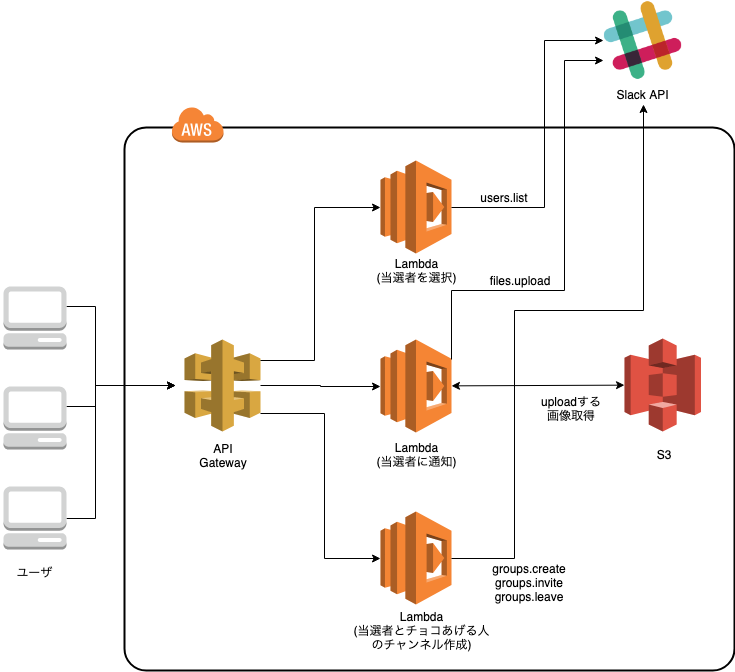
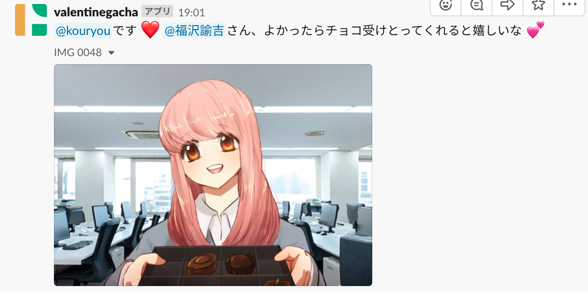
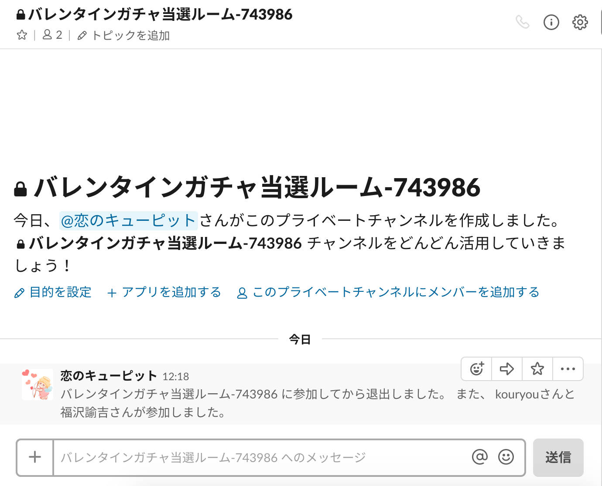

# バレンタインガチャ


このサービスは、「チョコが欲しい人」と「チョコが余ってる人」をつなぐバレンタインのネタ系サービスです。

## 前提
前提として、 Slack APIを利用したアプリケーションになっているため、  
事前に「チョコが欲しい人」と「チョコが余ってる人」は、指定されたSlackのワークスペースに入ってもらいます。

### 機能
- ガチャ機能  
「チョコが余ってる人」がチョコをあげたい人数を決めて、ガチャを回すことができます。
ガチャを回すと、「チョコが欲しい人」の中から指定した人数の当選者が選ばれます。(特に確率操作はしておらず、完全にランダムです)
- 通知機能  
当選者に通知するため、Slackを送ることができます。
- チャンネル作成機能  
当選者とチョコをあげる人が、その後のコミュニケーションを取りやすいように、専用のプライベートチャンネルを作成する機能があります。

### アーキテクチャ


### 使い方
#### ガチャAPI
リクエスト(numberは当選者数)
```
curl -X POST -H "Content-Type: application/json" -H "x-api-key: xxxxxxxxxxxxxxxxxx" -d '{"presenter_id":"チョコあげる人のユーザID", "number":1}' https://xxxxxxxx/users/select
```
レスポンスでは、当選者の名前とIDが返却されます。
```
{
    "winners": [
        {
            "name": "xxxxxx",
            "id": "yyyyyyy"
        }
    ]
}
```

#### 通知API
リクエスト
```
curl -X POST -H "Content-Type: application/json" -H "x-api-key: xxxxxxxxxxxxxxxxxx" -d '{"presenter_id":"チョコあげる人のユーザID", "winners_id":["当選者のユーザID"]}' https://xxxxxxxx/slack/channel/notice
```
以下のように特定のチャンネルに通知されます。


#### チャンネル作成API
リクエスト
```
curl -X POST -H "Content-Type: application/json" -H "x-api-key: xxxxxxxxxxxxxxxxxx" -d '{"presenter_id":"チョコあげる人のユーザID", "winners_id":["当選者のユーザID"]}' https://xxxxxxxx/slack/channel/create
```
レスポンスでは、新しいチャンネルのURLが返却されます。
```
{
    "winners": "https://xxxxxxxxxx.slack.com/messages/yyyyyyy"
}
```
以下のようにチャンネルが作成されます。
